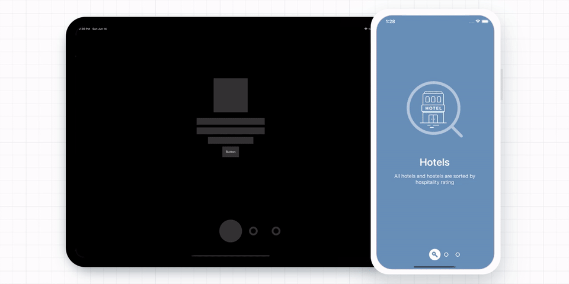

<div align="center">
<h1>Paper Onboarding</h1>

[](https://www.npmjs.com/package/@gorhom/paper-onboarding) [](https://www.npmjs.com/package/@gorhom/paper-onboarding) [](https://www.npmjs.com/package/@gorhom/paper-onboarding)



Paper Onboarding is a material design UI slider for `React Native` inspired by [Ramotion Paper Onboarding](https://github.com/Ramotion/paper-onboarding).

</div>

---

## Installation

```sh
yarn add @gorhom/paper-onboarding
# or
npm install @gorhom/paper-onboarding
```

> Also, you need to install [react-native-reanimated](https://github.com/software-mansion/react-native-reanimated), [react-native-gesture-handler](https://github.com/software-mansion/react-native-gesture-handler) & [react-native-svg](https://github.com/react-native-community/react-native-svg), and follow theirs installation instructions.

## Usage

```tsx
import PaperOnboarding, {PaperOnboardingItemType} from "@gorhom/paper-onboarding";

const data: PaperOnboardingItemType[] = [
  {
    title: 'Hotels',
    description: 'All hotels and hostels are sorted by hospitality rating',
    backgroundColor: '#698FB8',
    image: /* IMAGE COMPONENT */,
    icon: /* ICON COMPONENT */,
    content: /* CUSTOM COMPONENT */,
  },
  {
    title: 'Banks',
    description: 'We carefully verify all banks before add them into the app',
    backgroundColor: '#6CB2B8',
    image: /* IMAGE COMPONENT */,
    icon: /* ICON COMPONENT */,
    content: /* CUSTOM COMPONENT */,
  },
  {
    title: 'Stores',
    description: 'All local stores are categorized for your convenience',
    backgroundColor: '#9D8FBF',
    image: /* IMAGE COMPONENT */,
    icon: /* ICON COMPONENT */,
    content: /* CUSTOM COMPONENT */,
  },
];

const Screen = () => {
  const handleOnClosePress = () => console.log('navigate to other screen')
  return (
    <PaperOnboarding
      data={data}
      onCloseButtonPress={handleOnClosePress}
    />
  )
}
```

## Props

| name                     | description                                                          | required | type                                                       | default                                    |
| ------------------------ | -------------------------------------------------------------------- | -------- | ---------------------------------------------------------- | ------------------------------------------ |
| data                     | Array of pages/slides to present.                                    | YES      | Array<[PaperOnboardingItemType](#paperonboardingitemtype)> |                                            |
| safeInsets               | Safe area insets usually come from `react-native-safe-area-context`. | NO       | Insets                                                     | {top: 50, bottom: 50, left: 50, right: 50} |
| direction                | Pan gesture direction.                                               | NO       | 'horizontal' \| 'vertical'                                 | horizontal                                 |
| indicatorSize            | Indicator size (width and height).                                   | NO       | number                                                     | 40                                         |
| indicatorBackgroundColor | Indicator background color.                                          | NO       | string                                                     | white                                      |
| indicatorBorderColor     | Indicator border color.                                              | NO       | string                                                     | white                                      |
| titleStyle               | Text style to override `all` page/slide title style.                 | NO       | StyleProp<TextStyle>                                       |                                            |
| descriptionStyle         | Text style to override `all` page/slide description style.           | NO       | StyleProp<TextStyle>                                       |                                            |
| closeButton              | Custom component to be used instead of the default close button.     | NO       | (() => React.ReactNode) \| React.ReactNode                 |                                            |
| closeButtonText          | Close button text.                                                   | NO       | string                                                     | close                                      |
| closeButtonTextStyle     | Close button text style.                                             | NO       | StyleProp<TextStyle>                                       |                                            |
| onCloseButtonPress       | Callback on close button pressed.                                    | NO       | () => void                                                 |                                            |
| onIndexChange            | Callback when index change.                                          | NO       | () => void                                                 |                                            |

#### PaperOnboardingItemType

| name             | description                                                                                   | required | type                                                                                    |
| ---------------- | --------------------------------------------------------------------------------------------- | -------- | --------------------------------------------------------------------------------------- |
| content          | Slide/page content, this will replace default content.                                        | NO       | ((props: [PageContentProps](./src/types.ts#L87)) => React.ReactNode) \| React.ReactNode |
| image            | Image cover.                                                                                  | NO       | (() => React.ReactNode) \| React.ReactNode                                              |
| icon             | Indicator icon.                                                                               | NO       | (() => React.ReactNode) \| React.ReactNode                                              |
| backgroundColor  | Background color.                                                                             | YES      | string                                                                                  |
| title            | Title text.                                                                                   | NO       | string                                                                                  |
| description      | Description text.                                                                             | NO       | string                                                                                  |
| titleStyle       | Text style to override page/slide title default style.                                        | NO       | StyleProp<TextStyle>                                                                    |
| descriptionStyle | Text style to override page/slide description default style.                                  | NO       | StyleProp<TextStyle>                                                                    |
| showCloseButton  | Show close button when page/slide is active, _note: last page will always show close button._ | NO       | boolean                                                                                 |

## Built With ❤️

- [react-native-gesture-handler](https://github.com/software-mansion/react-native-gesture-handler)
- [react-native-reanimated](https://github.com/software-mansion/react-native-reanimated)
- [react-native-redash](https://github.com/wcandillon/react-native-redash)
- [react-native-svg](https://github.com/react-native-community/react-native-svg)
- [@react-native-community/bob](https://github.com/react-native-community/bob)

## Author

- [Mo Gorhom](https://twitter.com/gorhom)

## License

MIT

<div align="center">

Liked the library? 😇

<a href="https://www.buymeacoffee.com/gorhom" target="_blank"></a>

</div>

---

<p align="center">
<a href="https://gorhom.dev" target="_blank"></a>
</p>
